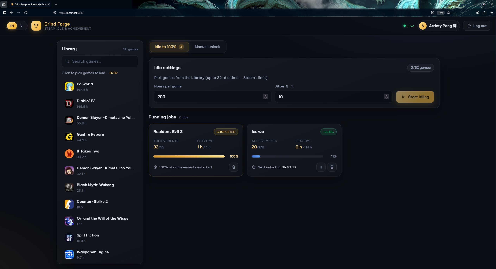

<div align="center">

# Grind Forge

**Steam idle & achievement farmer.** Park it on a VPS, log in with a QR code,
and let it farm playtime and achievements on your own account — 24/7, from any browser.

[](LICENSE)
[](https://github.com/arrietybeu/SteamIdleFarmer/actions/workflows/docker-image.yml)
[](https://github.com/arrietybeu/SteamIdleFarmer/pkgs/container/steamidlefarmer)
[](#stack)
[](#stack)
[](https://github.com/arrietybeu/SteamIdleFarmer/stargazers)



</div>

> *The "Idle to 100%" tab mid-run. Your Steam library sits on the left with real playtime per game;
> pick up to 32, set a target in hours, and each game gets its own drip schedule. Resident Evil 3 has
> finished here — 32/32 achievements across a one-hour target — while Icarus is 20/170 in with the
> next unlock counting down. Progress is measured in accrued idling time, so pausing or rebooting
> freezes it instead of skipping ahead. The other tab, "Manual unlock", lets you tick achievements
> and grant them instantly. Everything runs in English or Vietnamese and updates live over WebSocket.*

---

## Features

| Feature | What it does |
|---|---|
| **Idle to 100%** | Pick games, set a target in hours. It idles them for real playtime and drips the unlockable achievements evenly across that window until the game hits 100%. |
| **Manual unlock** | Pick a game, tick the achievements you want, unlock instantly — SAM-style, straight from the browser. |
| **Multi-user** | Every browser is its own session with its own Steam login. Share the URL and friends farm their own accounts, isolated from each other. |
| **QR login** | Scan with Steam Mobile. No password is ever typed, stored, or seen by the server. |
| **Resilient** | Sessions resume after a VPS reboot, reconnect with backoff after a Steam outage, and freeze progress instead of losing it. |
| **English / Vietnamese** | Full bilingual UI, switchable anywhere. |

## Quick start

No clone, no build — every push to `main` publishes a ready image to GHCR:

```bash
mkdir farmer && cd farmer
curl -O https://raw.githubusercontent.com/arrietybeu/SteamIdleFarmer/main/docker-compose.prod.yml
printf 'FARMER_SECRET=%s\n' "$(openssl rand -base64 48)" > .env
docker compose -f docker-compose.prod.yml up -d
```

Open `http://<vps-ip>:5080` → **Log in with Steam** → scan the QR → pick games → idle or unlock.
The encrypted database lives in `./data`.

Update to the newest build any time:

```bash
docker compose -f docker-compose.prod.yml pull && docker compose -f docker-compose.prod.yml up -d
```

<details>
<summary><b>Prefer to build it yourself?</b></summary>

```bash
git clone https://github.com/arrietybeu/SteamIdleFarmer && cd SteamIdleFarmer
cp .env.example .env      # set FARMER_SECRET, e.g. openssl rand -base64 48
docker compose up -d --build
```

</details>

## Before you start

- Breaks Steam's ToS — the account-limit risk is real. Use it on accounts you own.
- **Never** on VAC / anti-cheat games. Server-side protected achievements are auto-skipped.
- Playtime only accrues while the VPS is up and logged in.
- Tokens are encrypted at rest, but the server operator still holds them — only log in
  somewhere you trust, and only invite people who trust you.
- Many accounts farming from a single VPS IP draw more attention than one.

## Which games actually work?

| Game type | Works | Why |
|---|:---:|---|
| Single-player / offline titles | **Yes** | Achievements are settable by the client — the normal case. |
| Publisher-locked achievements | **No** | Steam only accepts writes from the publisher's own servers. Detected up front and skipped, so a run never stalls. |
| VAC / anti-cheat online games | **Never** | Technically blocked *and* not worth the account risk. |

A game showing `0/0` isn't a bug — it means nothing is left to unlock, either because you
already earned everything or because the publisher locked it.

## How it works

Achievements are spread evenly across your target hours with a little random jitter, so unlocks
never land on a suspiciously perfect clock. Crucially, the schedule is measured in **accrued
idling time, not wall-clock time**: pause a job or reboot the VPS and progress freezes rather
than skipping ahead, keeping unlocks in step with the playtime Steam actually recorded.

<details>
<summary><b>Configuration</b></summary>

| Variable | Default | Purpose |
|---|---|---|
| `FARMER_SECRET` | — | Encrypts stored Steam refresh tokens. Set it in production. |
| `FARMER_ACCESS_PASSWORD` | off | Optional app-level access gate for a public instance. |
| `FARMER_DEVICE_NAME` | `SteamIdleFarmer` | Name shown in the Steam Mobile confirmation. |
| `FARMER_DATA_DIR` | `/data` | Where the SQLite database lives. |
| `PORT` | `5080` | HTTP port. |

</details>

<details>
<summary><b>Development</b></summary>

Requires **.NET SDK 10** and **Node 22**.

```bash
# backend (port 5080)
cd backend && FARMER_SECRET=dev dotnet run --project src/SteamFarmer.Api

# frontend (proxies /api and /ws to :5080)
cd frontend && npm install && npm run dev
```

Run the tests: `cd backend && dotnet test`.

</details>

## Stack

.NET 10 (ASP.NET Core) on **SteamKit2** · **React 19 + Vite** · **SQLite**. The backend serves the
built frontend as a single container. Expose it publicly only behind a reverse proxy with TLS.

## License & credits

[MIT](LICENSE) © 2026 [arrietybeu](https://github.com/arrietybeu) · Steam networking via
[SteamKit2](https://github.com/SteamRE/SteamKit) · achievement handling inspired by
[gibbed's SteamAchievementManager](https://github.com/gibbed/SteamAchievementManager).
